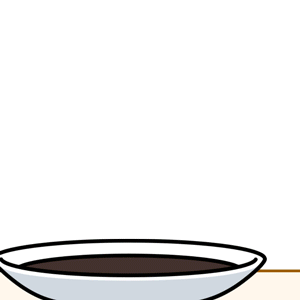

  

  
  <h2>💪 Skill</h2>
  
Learning can be tough, but sticking with it is what makes the difference.

  

  <h2>🐍 Contribution Snake</h2>
  <picture>
    <source media="(prefers-color-scheme: dark)" srcset="./github-snake-dark.svg" />
    <source media="(prefers-color-scheme: light)" srcset="./github-snake.svg" />
    
  </picture>

